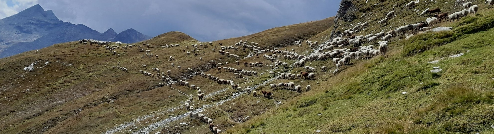
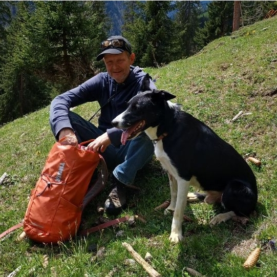
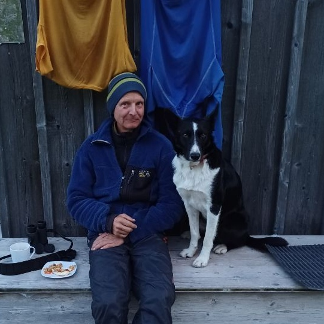

<link rel="stylesheet" type="text/css" href="./docs/assets/styles.css">

# Schafhirt Tinu Schneider

  

  Tinu Schneider     
  Linda 3     
  7412 Scharans   
    
  +41 (0)76 445 83 01    
  <a href="mailto:tinu@schafhirt.ch">tinu@schafhirt.ch</a>
  

  
  

    
    
  

 

## Arbeit mit Schafen

- Sommer 2023: Alp Starlera GR
- Winter 22/23: Betriebshelfer Stettler, Thurhof TG
- Sommer 2022: Alp Starlera GR
- Winter 21/22: Betriebshelfer Amacher, Hirzenloch BE
- Sommer 2021: Alp Karliböden/Zanai SG
- Winter 20/21: Schafhirtenausbildung

 

### Früher
- <a href="https://tinuschneider.ch" target="_blank">Tinu Schneider Datenanalyse</a>
- Umwelt-Ing. ETH
- Zimmermann
- Geboren 1968 in Bern
