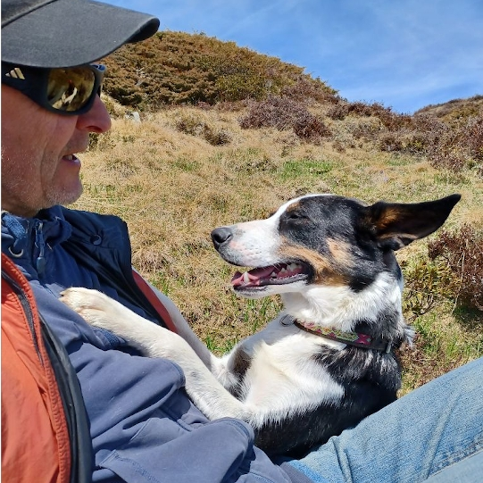

# Schafhirt Tinu Schneider

Tinu Schneider  
Linda 3  
7412 Scharans   
    
+41 (0)76 445 83 01    
<a href="mailto:tinu@schafhirt.ch">tinu@schafhirt.ch</a>  
  
   
   
 

 

## Arbeit mit Schafen

- Sommer 2023: Alp Starlera GR
- Winter 22/23: Betriebshelfer Stettler, Thurhof TG    
- Sommer 2022: Alp Starlera GR
- Winter 21/22: Betriebshelfer Amacher, Hirzenloch BE    
- Sommer 2021: Alp Karliböden/Zanai SG
- Winter 20/21: Schafhirtenausbildung

 

### Früher
- <a href="https://tinuschneider.ch" target="_blank">Tinu Schneider Datenanalyse</a>
- Umwelt-Ing. ETH
- Zimmermann
- Geboren 1968 in Bern
